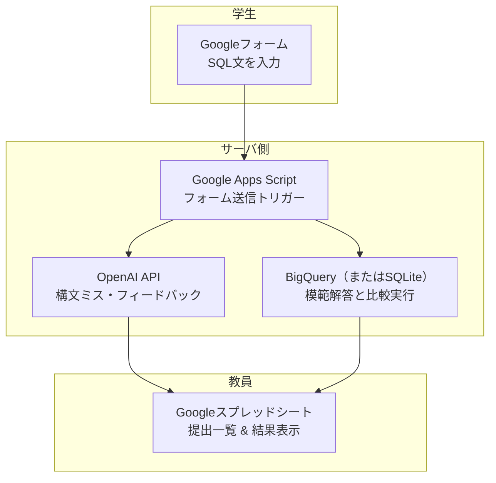

```mermaid
flowchart TD
    subgraph 学生
        A1[Googleフォーム<br>SQL文を入力]
    end

    subgraph 教員
        A2[Googleスプレッドシート<br>提出一覧 & 結果表示]
    end

    subgraph サーバ側
        B1[Google Apps Script<br>フォーム送信トリガー]
        B2[OpenAI API<br>構文ミス・フィードバック]
        B3[BigQuery（またはSQLite）<br>模範解答と比較実行]
    end

    A1 --> B1
    B1 --> B2
    B1 --> B3
    B2 --> A2
    B3 --> A2
```
