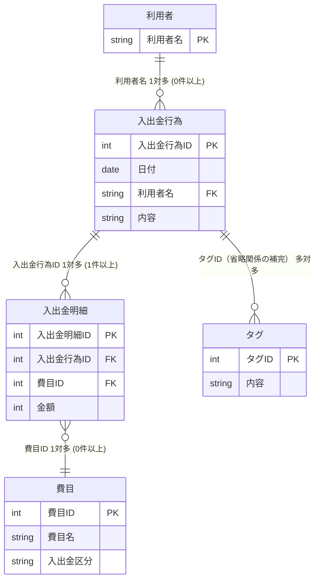
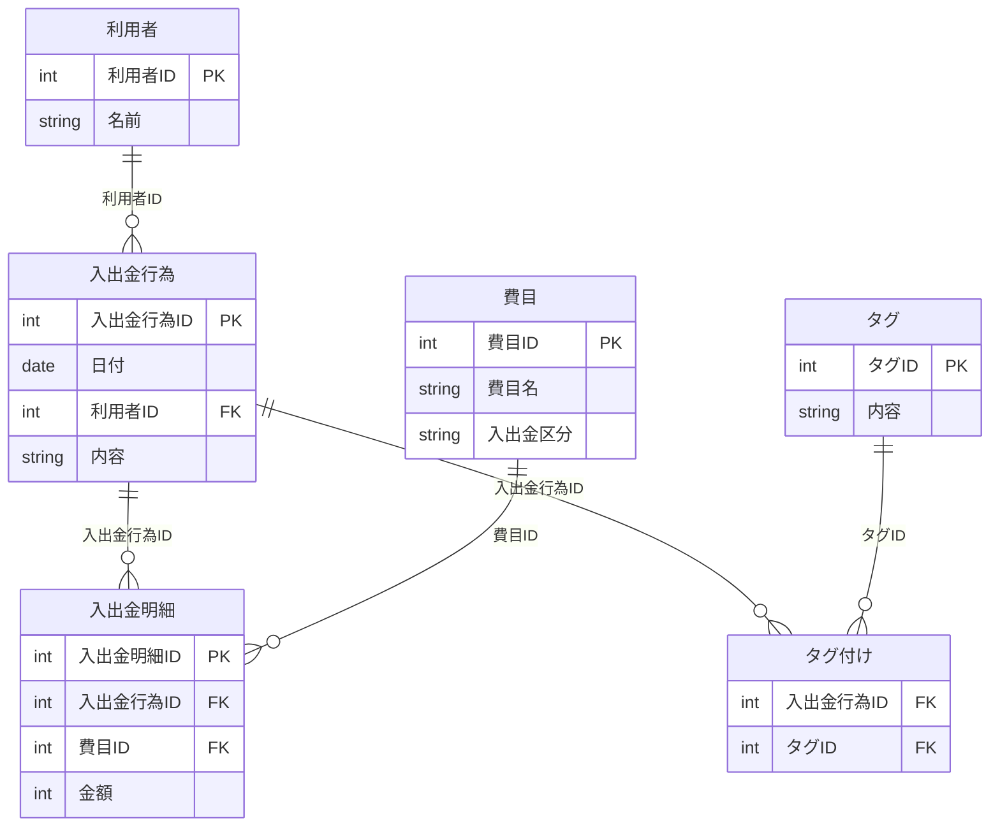
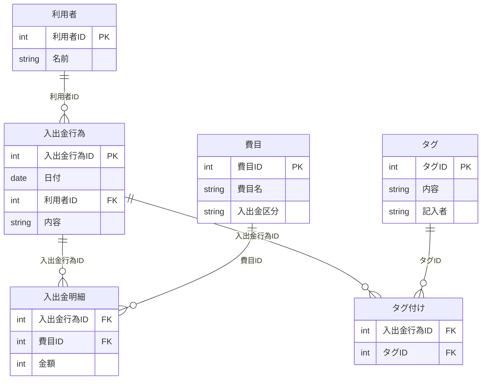
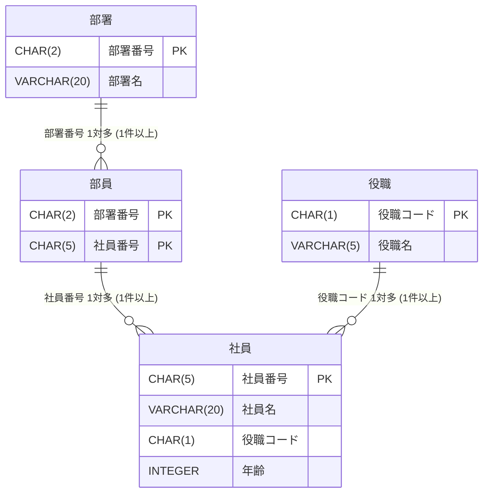
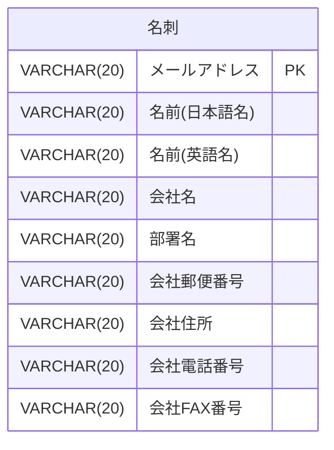
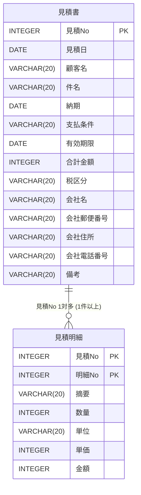

## 家計管理の概要をまとめたER図



## 論理設計の途中まで実施したER図




---

### ✅ 多重度の解釈

| 関係                    | 多重度                         |
|-------------------------|--------------------------------|
| 利用者 → 入出金行為     | 1対多（0件以上）               |
| 入出金行為 → 明細       | 1対多（1件以上）               |
| 明細 → 費目             | 多対1                          |
| 入出金行為 ↔ タグ       | 多対多（中間テーブルで管理）   |

---

## 完成した家計管理データベースER図




---

### 🔍 モデル解釈のポイント

- `入出金明細` は主キーとして「`入出金明細ID`」を使わず、**複合キー（入出金行為ID + 費目ID）** で表現されている構成です（図下の注釈より）。
- `タグ付け` は「入出金行為」と「タグ」の多対多の中間テーブルです。
- 多重度は以下のように解釈しています：

| 関係                   | 多重度             |
|------------------------|--------------------|
| 利用者 → 入出金行為    | 1対多（0件以上）   |
| 入出金行為 → 明細      | 1対多（1件以上）   |
| 明細 → 費目            | 多対1              |
| 入出金行為 ↔ タグ      | 多対多             |

---


## rpgデータベースのE-R図

```mermaid
erDiagram
    パーティー {
        CHAR(3) ID PK
        VARCHAR(20) 名称
        CHAR(2) 職業コード FK
        INTEGER HP
        INTEGER MP
        CHAR(2) 状態コード FK
    }

    イベント {
        INTEGER イベント番号 PK
        VARCHAR(50) イベント名称
        CHAR(1) タイプ FK
        INTEGER 前提イベント番号
        INTEGER 後続イベント番号
    }

    経験イベント {
        INTEGER イベント番号 PK
        CHAR(1) クリア区分
        CHAR(1) クリア結果
        INTEGER ルート番号
    }

    コード {
        INTEGER コード種別 PK
        CHAR(2) コード値 PK
        VARCHAR(100) コード名称
    }

    コード ||--o{ パーティー : "職業コード → コード(1)"
    コード ||--o{ パーティー : "状態コード → コード(2)"
    コード ||--o{ イベント : "タイプ → コード(3)"
    経験イベント ||--|| イベント : "イベント番号 → イベント"
    コード ||--o{ 経験イベント : "クリア結果 → コード(4)"
  ```

## p405 問題12-1
### 第1正規形

  ```mermaid
erDiagram
    部署 {
        CHAR(2) 部署番号 PK
        VARCHAR(20) 部署名
    }

    部員 {
        CHAR(2) 部署番号 PK
        CHAR(5) 社員番号 PK
        VARCHAR(20) 社員名
        CHAR(1) 役職コード
        VARCHAR(5) 役職名
        INTEGER 年齢
    }

    部署 ||--o{ 部員 : "部署番号 1対多 (1件以上)"
  ```

### 第2正規形

  ```mermaid
erDiagram
    部署 {
        CHAR(2) 部署番号 PK
        VARCHAR(20) 部署名
    }

    部員 {
        CHAR(2) 部署番号 PK
        CHAR(5) 社員番号 PK
    }

    社員 {
        CHAR(5) 社員番号 PK
        VARCHAR(20) 社員名
        CHAR(1) 役職コード
        VARCHAR(5) 役職名
        INTEGER 年齢
    }

    部署 ||--o{ 部員 : "部署番号 1対多 (1件以上)"
    部員 ||--o{ 社員 : "社員番号 1対多 (1件以上)"
```

### 第3正規形



## p405 問題12-2

```sql
CREATE TABLE dept (
    deptno CHAR(2) PRIMARY KEY,
    deptname VARCHAR(40) UNIQUE NOT NULL
);

CREATE TABLE pos (
    poscode CHAR(1) PRIMARY KEY,
    posname VARCHAR(20) UNIQUE NOT NULL
);

CREATE TABLE emp (
    empno CHAR(5) PRIMARY KEY,
    empname VARCHAR(40) NOT NULL,
    poscode CHAR(1) NOT NULL REFERENCES pos(poscode),
    age INTEGER CHECK(age >= 0)
);

CREATE TABLE member (
    deptno CHAR(2) NOT NULL REFERENCES dept(deptno),
    empno CHAR(5) NOT NULL REFERENCES emp(empno),
    PRIMARY KEY(deptno, empno)
);
```

## p405 問題12-3

### 1.名刺



### 2.見積書


