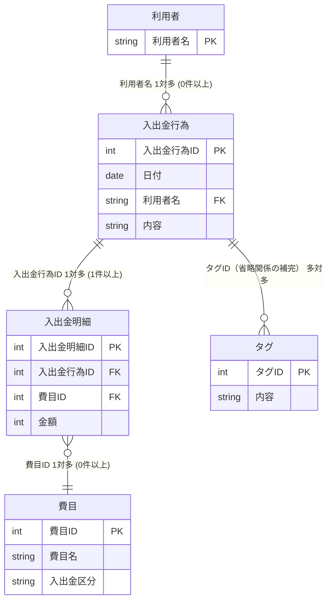
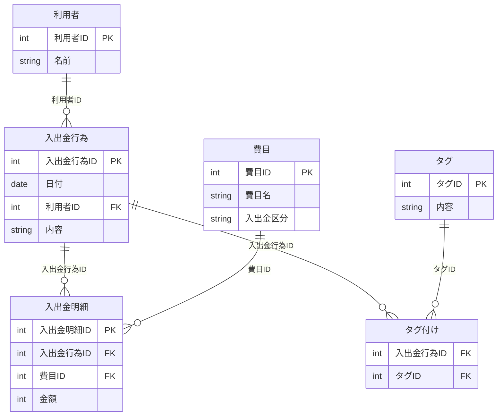
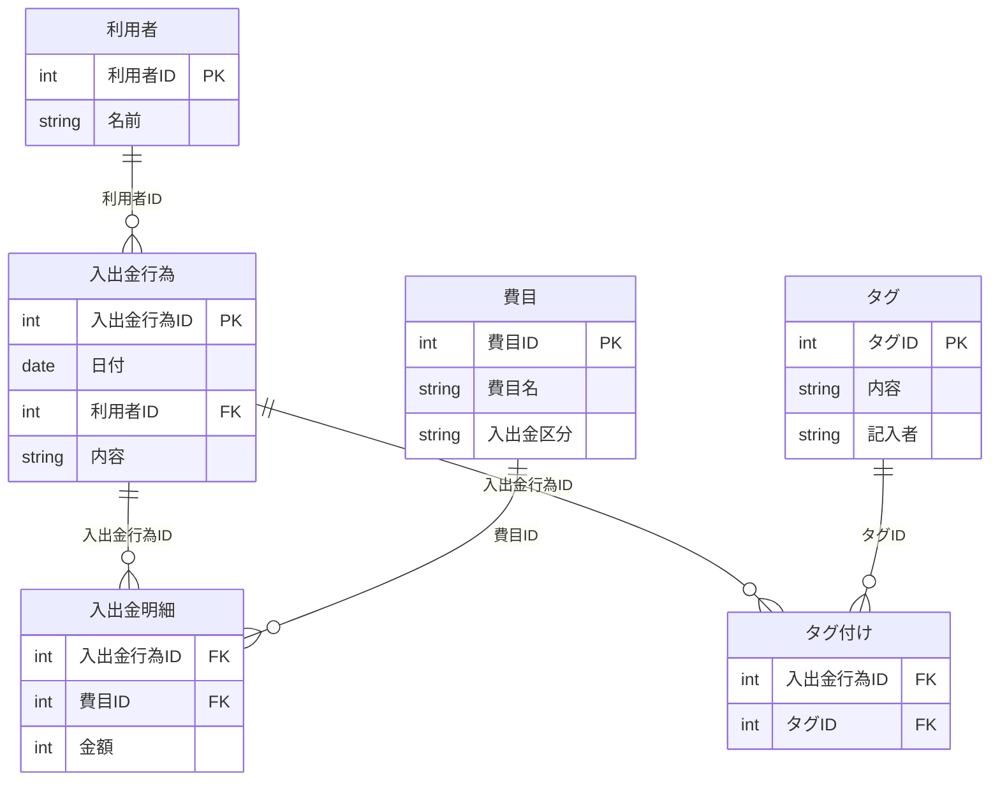

## 家計管理の概要をまとめたER図



## 論理設計の途中まで実施したER図




---

### ✅ 多重度の解釈（図から推定）

| 関係                    | 多重度                         |
|-------------------------|--------------------------------|
| 利用者 → 入出金行為     | 1対多（0件以上）               |
| 入出金行為 → 明細       | 1対多（1件以上）               |
| 明細 → 費目             | 多対1                          |
| 入出金行為 ↔ タグ       | 多対多（中間テーブルで管理）   |

---

## 完成した家計管理データベースER図



## rpgデータベースのE-R図

```mermaid
erDiagram
    パーティー {
        CHAR(3) ID PK
        VARCHAR(20) 名称
        CHAR(2) 職業コード FK
        INTEGER HP
        INTEGER MP
        CHAR(2) 状態コード FK
    }

    イベント {
        INTEGER イベント番号 PK
        VARCHAR(50) イベント名称
        CHAR(1) タイプ FK
        INTEGER 前提イベント番号
        INTEGER 後続イベント番号
    }

    経験イベント {
        INTEGER イベント番号 PK
        CHAR(1) クリア区分
        CHAR(1) クリア結果
        INTEGER ルート番号
    }

    コード {
        INTEGER コード種別 PK
        CHAR(2) コード値 PK
        VARCHAR(100) コード名称
    }

    コード ||--o{ パーティー : "職業コード → コード(1)"
    コード ||--o{ パーティー : "状態コード → コード(2)"
    コード ||--o{ イベント : "タイプ → コード(3)"
    経験イベント ||--|| イベント : "イベント番号 → イベント"
    コード ||--o{ 経験イベント : "クリア結果 → コード(4)"
  ```